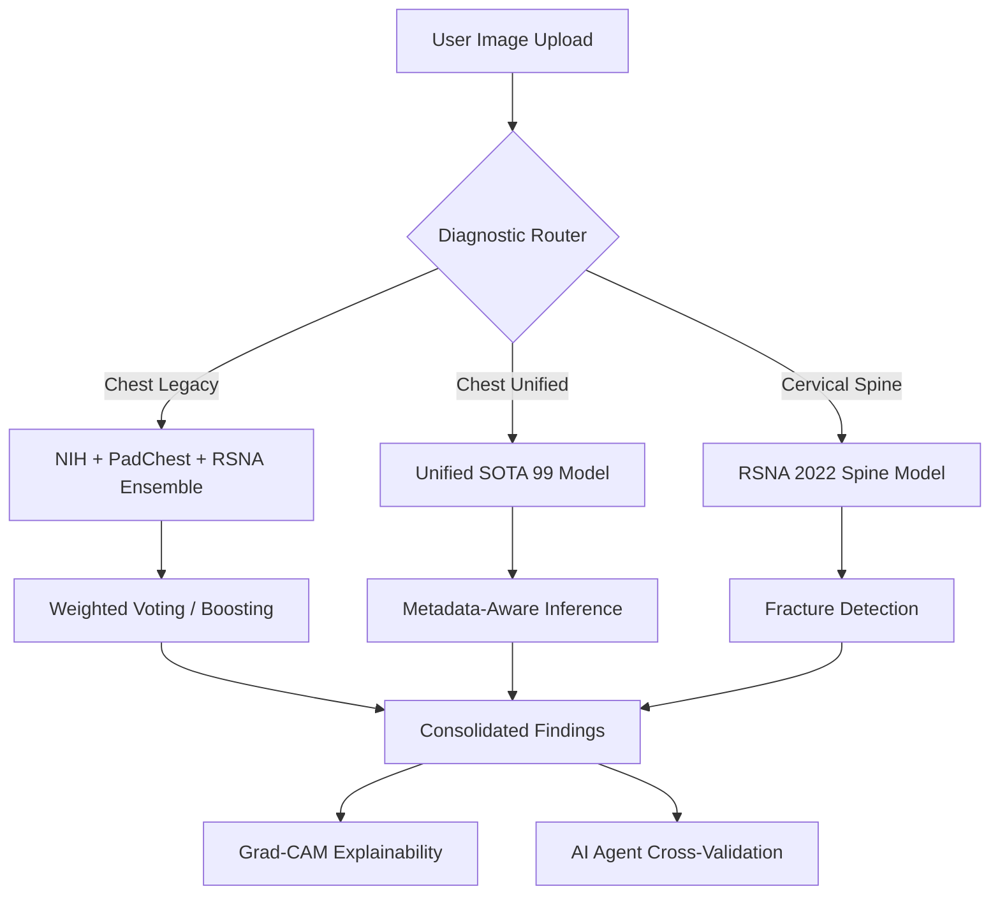

# Sahayak: An Autonomous X-Ray Diagnostic Orchestrator

## 1. Executive Summary
**Sahayak** is a state-of-the-art medical imaging diagnostic platform designed to bridge the gap between AI research and clinical utility. By employing a **Diagnostic Router** that orchestrates an ensemble of Specialized Convolutional Neural Networks (CNNs) and Vision-Language Models (VLMs), Sahayak provides high-precision screening for 15+ lung conditions and cervical spine fractures.

## 2. System Architecture

### 2.1 The Diagnostic Router
The core of the system is the `DiagnosticRouter`, which intelligently determines the optimal analysis path based on the user's input (Body Part, Scan Type) and the selected engine mode.

### 2.2 Ensemble Strategy
Instead of relying on a single model, Sahayak utilizes a **Weighted Ensemble** strategy for Chest X-Rays:
- **NIH-15 Model**: Trained on the NIH ChestX-ray14 dataset (DenseNet121 architecture).
- **PadChest Model**: Specialized for European clinical data.
- **RSNA Pneumonia Model**: EfficientNetB4-based binary classifier.

The system performs **Clinical Correlation Boosting**, where findings like *Infiltration* and *Effusion* are used to weight the probability of *Pneumonia*, mirroring human radiological reasoning.

## 3. Dedicated Model Training

### 3.1 Unified Chest Model (SOTA 99)
This model represents the pinnacle of the system's chest diagnostic capabilities.
- **Datasets**: Unified training on **Indiana University (IU)**, **NIH Chest X-rays**, and **VinBigData** datasets.
- **Input Dimension**: 256x256 RGB + Metadata.
- **Metadata Integration**: Incorporates patient **Age** (normalized) and **Gender** (binary encoded) to refine diagnostic accuracy.
- **Training Infrastructure**:
    - **Runtime**: 2h 24m 28s
    - **Hardware**: NVIDIA Tesla P100 GPU (Kaggle)
    - **Version**: v23 Stable Production Release
- **License**: Apache 2.0 Open Source.

### 3.2 Cervical Vertebrae and Spine Model
Dedicated to detecting fractures in the cervical spine, integrated from the RSNA 2022 competition.
- **Datasets**: RSNA 2022 Cervical Spine Fracture Detection.
- **Architecture**: Volumetric sequence analysis (Optimized for VRAM).
- **Training Infrastructure**:
    - **Runtime**: 1h 36m 22s
    - **Hardware**: NVIDIA Tesla P100 GPU (Kaggle)
    - **Version**: v31 Final
- **License**: Apache 2.0 Open Source.

## 4. Advanced Features

### 4.1 Explainable AI (XAI) with Grad-CAM
To build clinical trust, Sahayak implements **Gradient-weighted Class Activation Mapping (Grad-CAM)**. This identifies the specific regions of the X-ray that the AI focused on to reach its conclusion, allowing radiologists to verify the spatial accuracy of the diagnosis.

### 4.2 Multi-Agent Cross-Validation
Sahayak integrates a "Second Opinion" layer using an AI Agent (`ai_agent.py`) that queries top-tier Vision LLMs:
1. **SambaNova (Llama 3.2 11B Vision)**: Primary fallback for high-speed inference.
2. **Groq (Llama Vision)**: Extreme low-latency validation.
3. **Google Gemini 2.0 Flash**: High-reasoning multimodal analysis.
4. **OpenAI GPT-4o**: Golden standard for creative radiological interpretation.

## 5. User Interface & Experience
The application offers two distinct modes:
- **Healthcare Professional**: Detailed metrics, full disease breakdown (14 labels), and high-resolution Grad-CAM heatmaps.
- **Patient Mode**: Simple, non-alarmist descriptions with clear "Next Step" recommendations (e.g., "Likely Healthy", "Consult Physician").

## 6. Technical Stack
- **Deep Learning**: TensorFlow, Keras (EfficientNetB4, DenseNet121).
- **Frontend**: Streamlit (Production-grade medical dashboard).
- **Processing**: OpenCV, NumPy, Pillow.
- **LLM Orchestration**: SambaNova API, Groq SDK, Google Generative AI, OpenAI SDK.

## 7. Conclusion & Future Outlook
Sahayak successfully demonstrates the power of ensembling specialized vision models with large language models. The project is currently expanding into:
- **Neuro-AI**: Brain MRI analysis.
- **Ortho-AI**: Bone fracture detection in extremities.
- **Ophthalmic-AI**: Retinal scan interpretation.

---
*Created by Saurabh Bajpai · April 2026*
